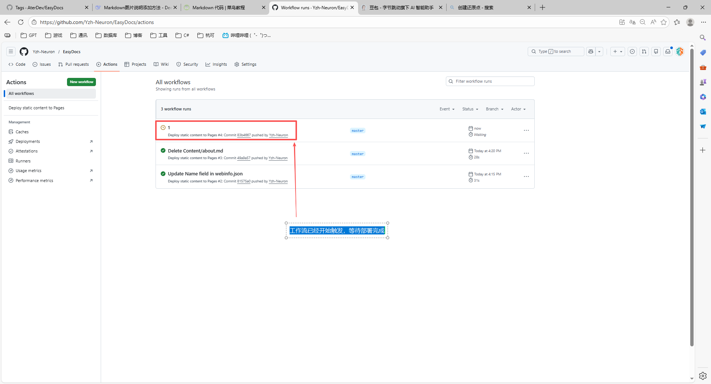
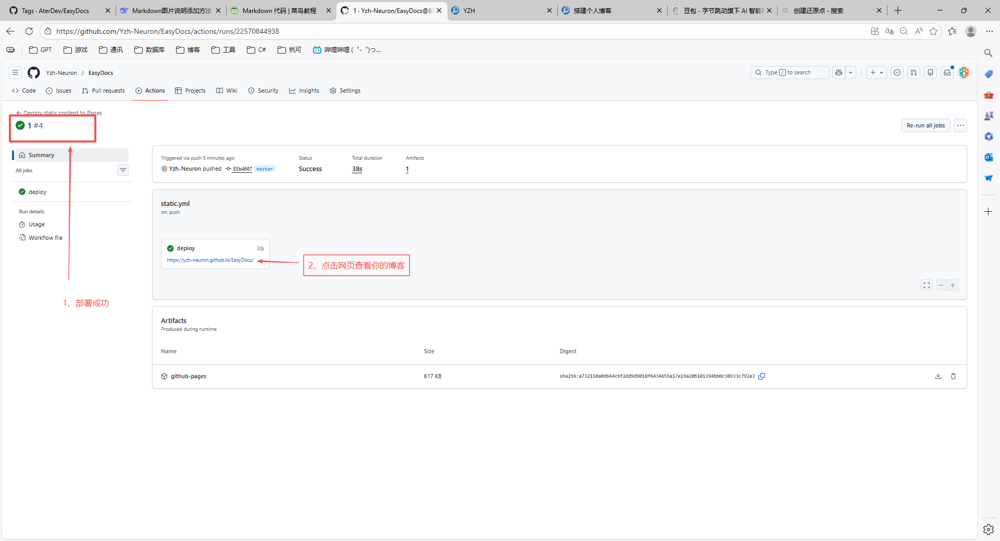

# 搭建个人博客

你是否想拥有自己的技术博客，或者文档站点？本工具将帮助你生成博客和文档的纯静态站点，让你可以轻松部署到任意位置。  

EasyDocs 是一个开源项目，托管在 Github 上，可通过以下步骤将项目 Clone（或 Fork）到自己的 Github 仓库，快速搭建专属静态博客 / 文档站。

## 搭建过程

1. 获取 EasyDocs 项目源码
    打开 EasyDocs 的 Github 仓库页面，地址为：(https://github.com/AterDev/EasyDocs/)
	
	
	

2. 修改webinfo.json配置文件
    找到项目根目录的webinfo.json文件，根据自身需求修改配置项，关键项需严格按要求配置，代码如下：
	```json
	 {
      "Name": "YZH",// 博客名称，显示在主页顶部导航栏
      "Description": "工作笔记",// 博客说明，显示在主页顶部中间位置
      "AuthorName": "小严",// 作者名称，显示在博客列表页文章旁
      "BaseHref": "/EasyDocs/",// 【重要】务必与Github仓库名称保持一致，生成站点时会自动添加到路径前缀
      "Branch": "master",// 部署分支，保持默认即可
      "Logo": "logo.png",// 博客logo图片，放置在项目根目录
      "ContentPath": "./Content",// markdown文档存放根路径，工具会自动扫描该目录下所有md文件生成站点
      "OutputPath": "./WebApp",// 静态站点生成输出路径，保持默认即可
      "Domain": "https://Yzh-Neuron.github.io/", // 自定义域名，生成站点地图sitemap使用，无自定义域名则留空
      "Keywords": "docs,blog,EasyDocs"// 站点关键词，用于SEO优化
    }
	```
3. 修改 GitHub Actions 部署配置文件
    在__./EasyDocs/.github/workflows__文件路径下找到static.yml配置文件，按以下内容修改，实现代码推送后的自动化构建与部署：
	```yml
      name: Deploy static content to Pages
      on:
        push:
          branches: ["master"]          # 推送到 master 分支时触发
        workflow_dispatch:               # 支持手动触发

      permissions:
        contents: read
        pages: write
        id-token: write

      concurrency:
        group: "pages"
        cancel-in-progress: false

      jobs:
        deploy:
          environment:
            name: github-pages
            url: ${{ steps.deployment.outputs.page_url }}
          runs-on: ubuntu-latest
          steps:
            - name: Checkout
              uses: actions/checkout@v4

            - name: Setup Pages
              uses: actions/configure-pages@v4

            - name: Setup .NET
              uses: actions/setup-dotnet@v4
              with:
                dotnet-version: '8.x'

            - name: Install EasyBlog tool
              run: dotnet tool install -g Ater.EasyBlog --version 1.0.0

            - name: Build site
              run: ezblog build ./Content ./site

            - name: Upload artifact
              uses: actions/upload-pages-artifact@v3
              with:
                path: 'site/'

            - name: Deploy to GitHub Pages
              id: deployment
              uses: actions/deploy-pages@v4
    ```
4. 创建 Github 仓库并启用 GitHub Pages
    - 登录 Github 账号，点击创建新的仓库。<br>
    - 仓库名称必须与webinfo.json配置文件中的BaseHref保持一致（如上例中为 EasyDocs）。<br>
    - 仓库创建完成后，进入仓库设置页面，找到 GitHub Pages 功能并开启。<br>
    
    > [!NOTE]
    > 仓库名字和webinfo.json配置文件中的BaseHref保持一致（如上例中为EasyDocs）。

	
 
 	

5. 提交代码并等待自动化部署

    将本地修改后的所有配置文件、项目文件提交并推送到 Github 仓库的 master 分支，随后进入仓库的 Actions 页面，可查看工作流执行状态。

    
   
    
    
    等待工作流执行完成后，即可通过 GitHub Pages 分配的地址访问自己的个人博客 / 文档站。

## 添加一个博客

博客内容存放在（__./ Content / blogs__ ）目录下，每篇博客对应一个 Markdown 文件。添加新博客的步骤如下：

1. 创建 Markdown 文件
在 Content 文件夹中新建一个 .md 文件，例如 my-first-blog.md。文件名将作为 URL 的一部分，建议使用英文、数字和连字符。

2. 编写博客内容
文件内容采用 Markdown 语法，示例：

    ```markdown
        ---
        title: 我的第一篇博客
        date: 2025-03-02
        tags: [教程, EasyDocs]
        ---

        # 欢迎！

        这是使用 EasyDocs 发布的第一篇文章。  
        你可以在这里写任何内容，支持 **加粗**、*斜体*、[链接](https://example.com) 等标准 Markdown 语法。

        ## 插入图片
        

        > 引用一段话。
    ```
