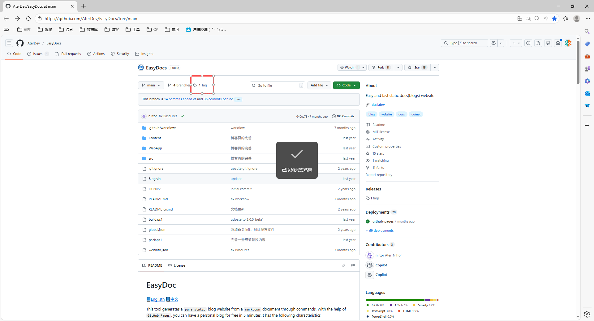
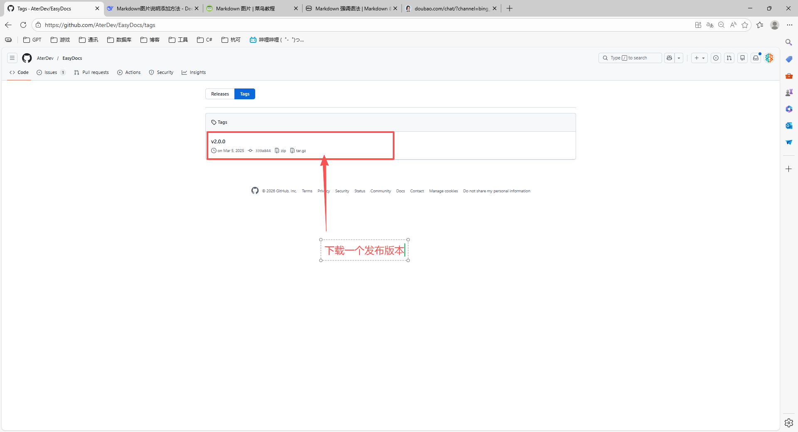
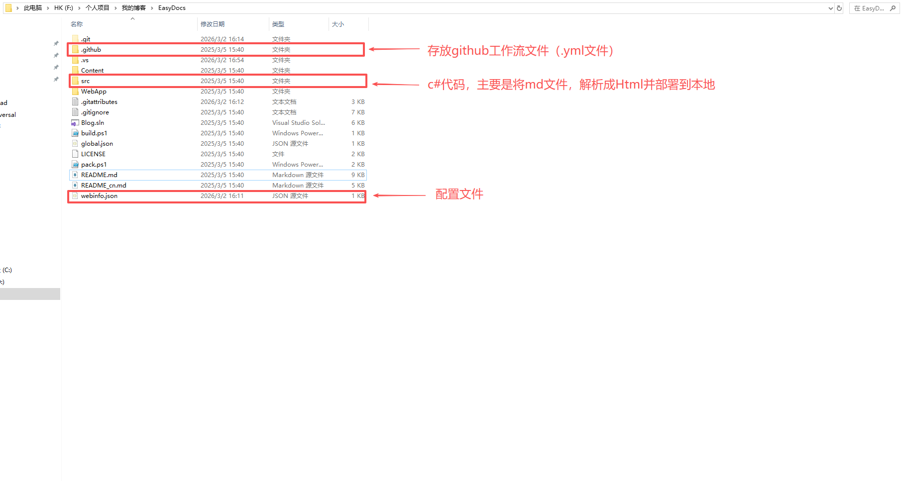
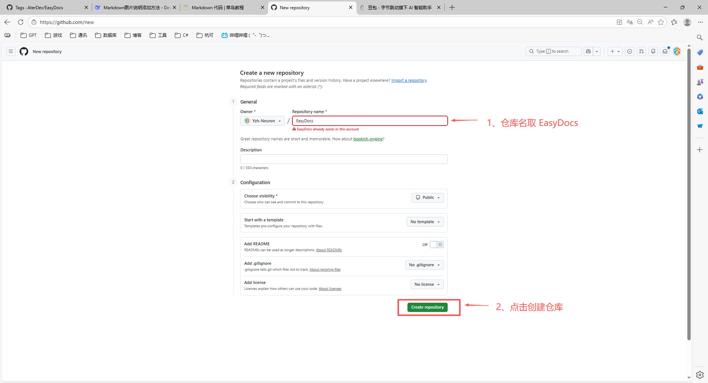
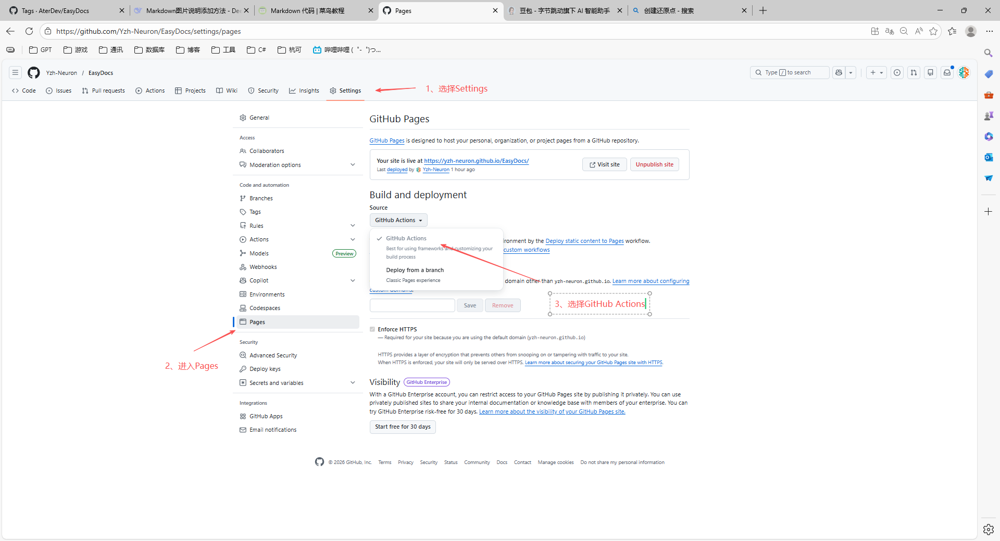

# 搭建个人博客

您是否想拥有自己的技术博客，或者文档站点？本工具将帮助您生成博客和文档的纯静态站点，让你可以轻松的部署到任何位置。
EasyDocs是一个开源项目，托管在Github上。我们可以通过以下步骤将项目Clone（或Fork）一份到自己的Github仓库：

1. 打开EasyDocs的Github仓库页面，地址为：(https://github.com/AterDev/EasyDocs/)

	
	> 图1：点击Tag

	
	> 图2：下载一个发布版本

	
	> 图3：解压或者克隆后的文件结构说明
  
2. 修改webinfo.json配置文件

	```json
	{
	  "Name": "YZH",// 博客名称，显示在主页顶部导航
	  "Description": "工作笔记",// 说明，显示在主页顶部中间
	  "AuthorName": "小严",// 作者名称，显示在博客列表
	  "BaseHref": "/EasyDocs/",// （切记）一定要和Github仓库的名字保持一致，生成站点时会自动添加到路径前面
	  "Branch": "master",
	  "Logo": "logo.png",
	  "ContentPath": "./Content",// markdown文档存放路径，工具会扫描该目录下的markdown文件并生成站点
	  "OutputPath": "./WebApp",
	  "Domain": "https://Yzh-Neuron.github.io/", // 域名，生成sitemap使用，不生成则留空
	  "Keywords": "docs,blog,EasyDocs",
	}
	```
3. 在 __(.\EasyDocs\.github\workflows)__ 文件路径下找到static.yml配置文件并修改

    ```yml
    # 工作流名称：部署静态内容到 GitHub Pages
    name: Deploy static content to Pages

    # 触发条件
    on:
      # 当推送到 master 分支时触发(切记一定推送到这个分支才能触发)
      push:
        branches: ["master"]
      # 允许在 GitHub 网页端手动触发工作流
      workflow_dispatch:

    # 赋予 GITHUB_TOKEN 的权限
    permissions:
      contents: read           # 允许读取仓库内容
      pages: write             # 允许写入 GitHub Pages
      id-token: write          # 允许使用 OIDC 令牌（用于部署身份验证）

    # 并发控制：防止多个部署同时运行
    concurrency:
      group: "pages"           # 部署分组为 pages，同一时间只有一个运行
      cancel-in-progress: false # 如果已有运行中的工作流，不要取消，让当前排队等待

    jobs:
      # 唯一的部署作业
      deploy:
        environment:
          name: github-pages    # 部署环境名称
          url: ${{ steps.deployment.outputs.page_url }} # 部署后的 URL，由 deploy-pages 步骤输出
        runs-on: ubuntu-latest   # 使用最新的 Ubuntu 运行器

        steps:
          # 1. 检出代码
          - name: Checkout
            uses: actions/checkout@v4

          # 2. 配置 GitHub Pages 环境（设置默认构建参数）
          - name: Setup Pages
            uses: actions/configure-pages@v4

          # 3. 安装 .NET SDK（因为 EasyBlog 工具需要 .NET 环境）
          - name: Dotnet
            uses: actions/setup-dotnet@v4
            with:
              dotnet-version: '8.x'   # 使用 .NET 8.x 版本

          # 4. 安装 EasyBlog 全局工具（版本 1.0.0）
          - run: dotnet tool install  -g Ater.EasyBlog --version 1.0.0

          # 5. 使用 EasyBlog 构建站点：从 Content 目录生成静态文件到 site 目录
          - run: ezblog build ./Content ./site

          # 6. 将生成的 site 目录上传为 GitHub Pages 构件
          - name: Upload artifact
            uses: actions/upload-pages-artifact@v3
            with:
              path: 'site/'      # 指定上传的目录路径

          # 7. 部署构件到 GitHub Pages
          - name: Deploy to GitHub Pages
            id: deployment        # 给此步骤一个 ID，以便后续引用其输出
            uses: actions/deploy-pages@v4
    ```

4. 登录Github，创建一个新的仓库，并启动Github Pages。

    > [!NOTE]
    > 仓库名字和webinfo.json配置文件中的BaseHref保持一致（如上例中为EasyDocs）。


	
	> 图4：创建一个EasyDocs仓储

 	
	> 图5：开启GitHubPages


5. 将修改后的文件提交到Github仓库的master分支，等待Github Actions自动构建和部署。
1. 
    
    > 图6：提交代码
    